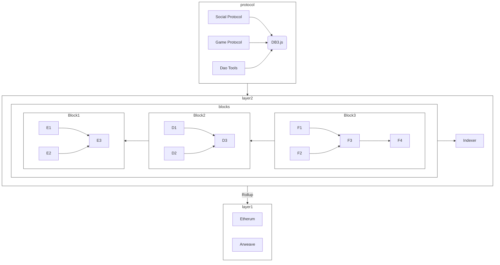

# DB3 Network:A Decentralized and Scalable AR-Rollup Data Network

## Overview

```mermaid
graph TD
    subgraph protocol
        A[Social Protocol] --> SDK(DB3.js)
        B[Game Protocol] -->SDK(DB3.js)
        C[Dao Tools] --> SDK(DB3.js)
        style protocol fill:#fff,stroke:#333,stroke-width:1px
    end

    subgraph layer2
        subgraph blocks
            subgraph Block1
                direction LR
                E1 --> E3
                E2 --> E3
                style Block1 fill:#fff,stroke:#333,stroke-width:1px
            end
            subgraph Block2
                direction LR
                D1 --> D3
                D2 --> D3
                style Block2 fill:#fff,stroke:#333,stroke-width:1px
            end
            subgraph Block3
                direction LR
                F1 --> F3
                F2 --> F3
                F3 --> F4
                style Block3 fill:#fff,stroke:#333,stroke-width:1px
            end
            Block2 --> Block1
            Block3 --> Block2
            direction RL
            style blocks fill:#fff,stroke:#333,stroke-width:1px
        end
        blocks --> Indexer
        style layer2 fill:#fff,stroke:#333,stroke-width:1px
        direction LR
    end

    subgraph layer1
        Etherum
        Arweave
        style layer1 fill:#fff,stroke:#333,stroke-width:1px
    end

    protocol --> layer2
    layer2 --> |Rollup|layer1
```

## DIPS

* [DIP-000: Structured Binary Data Format](./dips/dip-000.md)
