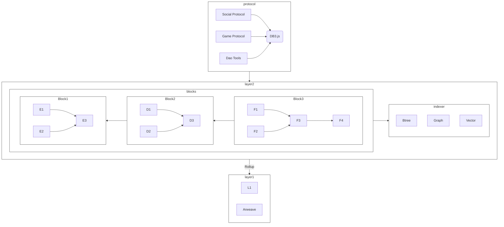

# DB3 Network:A Decentralized and Scalable Data-Rollup Data Network

db3 network is a fully decentralized data network. You can fully control your data, nobody can delete or modify your data and you can reach your data from any application in the db3 network. db3 network has the following technology features

* `Permanent Level  Data Availability`, data availability is the most important things in the decentralized network and db3 network uses arweave as a long term data availability layer to achieve the permanent level data availability
* `AR-Rollup`, db3 network itself will act a short term data availability layer and uses ar-rollup to improve the write throughput, reduce the storage cost and support privacy protection
* `Web2 Developer Experience`, you can use db3.js like using firebase sdk

## DIPS
| title   |    author     | status |
|----------|-------------|---------|
|[DIP-000: Structured Binary Data Format](./dips/dip-000.md)| [imotai](https://github.com/imotai) | wip |

## Contribution

if you are interested in db3 network, you can propose an improvement propsal here
