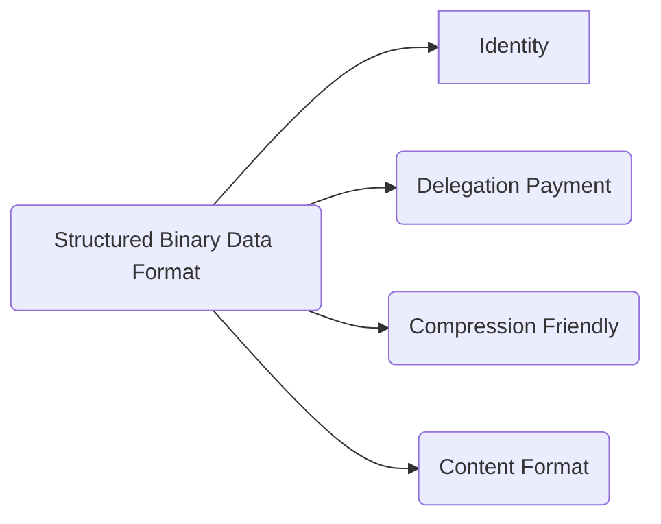
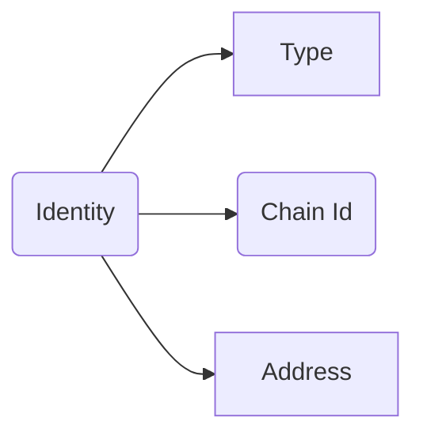
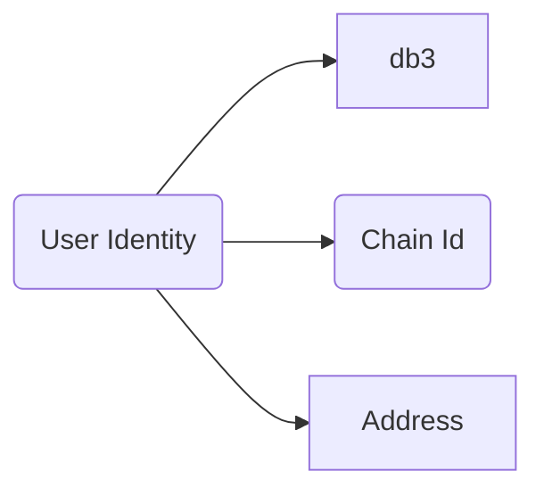
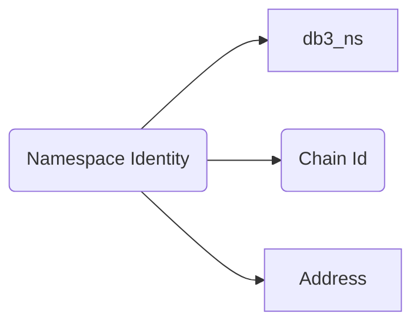

# DIP-000: Structured Binary Data Format

DB3 Network is building the next generation of decentralized and permissionless data network for the next big things Web3 and the open data format will be the first problem to be resolved

* Identity will address the crosschain data ownership
* Delegation payment will give the end user a zero gas experience
* Compression friendly will reduce the storage cost on L1 storage chain, eg Arweave
* Content Format will define the data types that db3 network will support

## Identity

the identity includes three parts

1. type, there are two types `db3` and `db3_ns` , the `db3` is a user type and the `db3_ns` is a namespace type
2. chain id, this is a unique id of every blockchain and we will use their token as the chain id
3. address, the address in every blockchain

### Identity of User

an example id of ethereum user is `db3:eth:0xF78c7469939f1f21338E4E58b901EC7D9Aa29679`

### Identity of Namespace

an example id of namespace
`db3_ns:ar:0xFC89000...E4`
