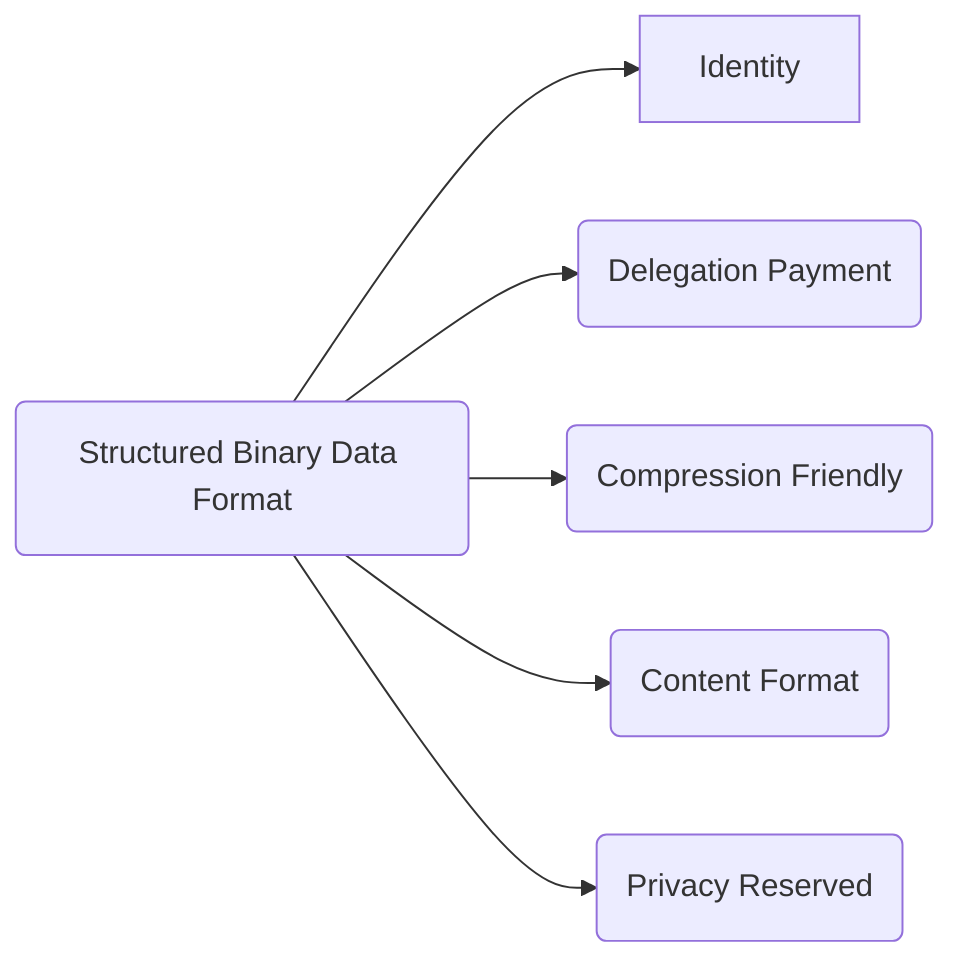
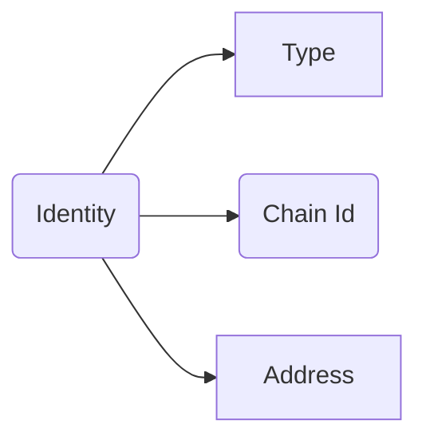
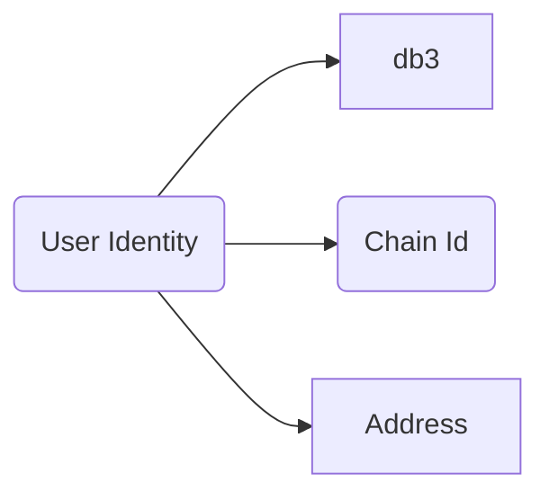
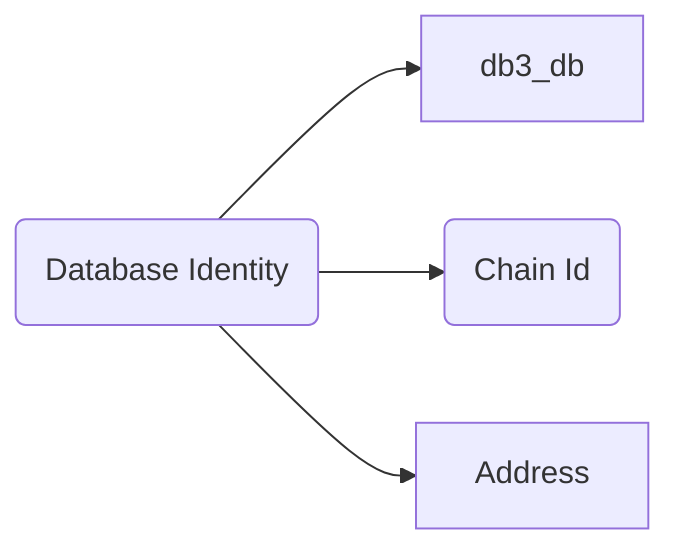

# DIP-000: Structured Binary Data Format

DB3 Network is building the next generation of the decentralized and permissionless data network for the next big things Web3 and the open data format will be the first problem to be resolved

* Identity will address the crosschain data ownership
* Delegation payment will give the end user a zero gas experience
* Compression friendly will reduce the storage cost on L1 storage chain, eg Arweave
* Content Format will define the data types that db3 network will support
* The user can write a privacy reserved data into db3 netwrok

## Identity

the identity includes three parts

1. type, there are two types `db3` and `db3_db` , the `db3` is a user type and the `db3_db` is a namespace type
2. chain id, this is a unique id of every blockchain and we will use their token as the chain id
3. address, the address in every blockchain

### Identity of User

an example id `db3:eth:0xF78c7469939f1f21338E4E58b901EC7D9Aa29679` means an ethereum user with address `0xF78c7469939f1f21338E4E58b901EC7D9Aa29679`

### Identity of Database

an example id `db3_db:ar:0xF78c7469939f1f21338E4E58b901EC7D9Aa29679` means a database with address `0xF78c7469939f1f21338E4E58b901EC7D9Aa29679` in db3 network and using Arweave as the L1 data available layer

### Identity of Collection

The collection can has its name in the database, if we want find the collection with its name, we must have the database address. So we can get a collection by url `db3_db:ar:0xF78c7469939f1f21338E4E58b901EC7D9Aa29679/collection1`

the length of collecion name is limited to `16 characters`

### Identity of Document

Every document has a fixed lenght id(64 byte)
