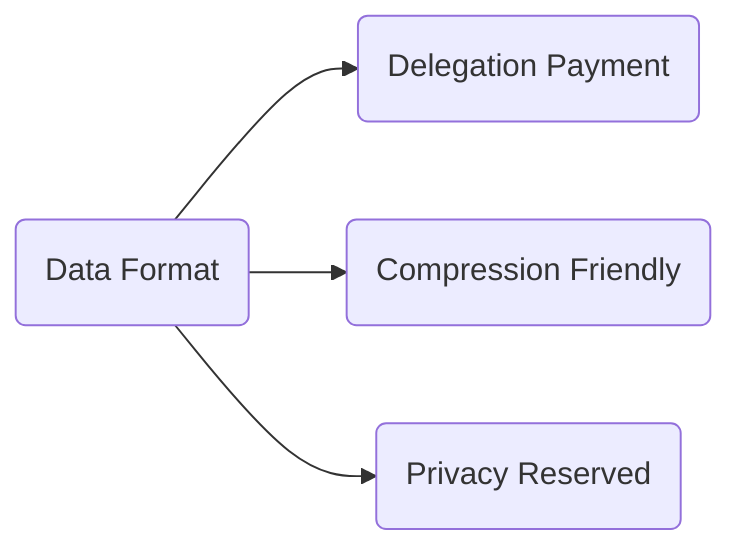
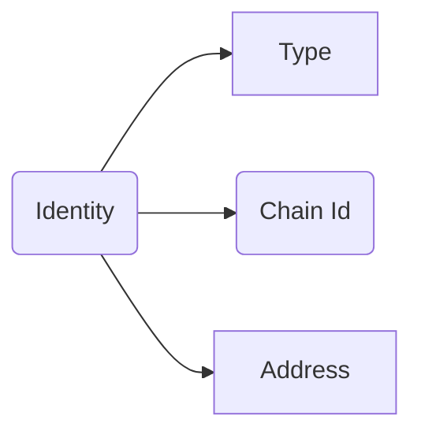
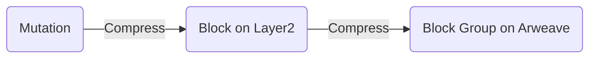
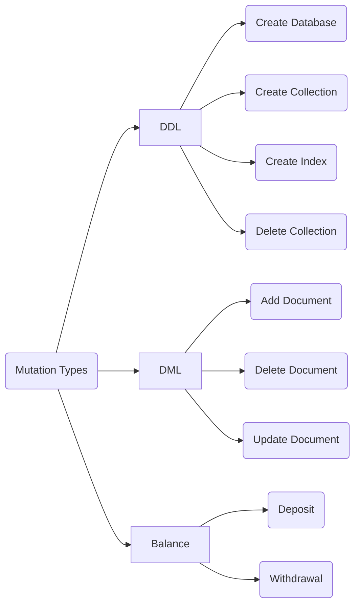

# DIP-000: Structured Binary Data Format for DB3

DB3 Network is building the next generation of the decentralized and permissionless data network for the next big things Web3 and the open data format will be the first problem to be resolved

## Requirements

The data format should support the following features

* `Delegation Payment` will give the end users a zero gas experience
* `Compression friendly` will reduce the storage cost on L1 storage chain, eg Arweave
* `Privacy Reserved` will enable privacy protection for the end users

## Concepts

* `user` who signs the data and sends the data to db3 network
* `delegation` who will pay the gas fee for users
* `identity`, every user , delegation and database have their unique identity
* `database` which is a group of collections and every database has a unique identity in the db3 network
* `mutation` which is the input of db3 network

### Identity

the identity includes three parts

1. type, there are two types `db3` and `db3_db` , the `db3` is a user type and the `db3_db` is a namespace type
2. chain id, this is a unique id of every blockchain and we will use their token as the chain id
3. address, the address in every blockchain

| identity   |      example      |
|----------|-------------|
| user |  db3:eth:0xF78c7469939f1f21338E4E58b901EC7D9Aa29679 |
| database |  db3_db:ar:0xF78c7469939f1f21338E4E58b901EC7D9Aa29679 |

## Data Flow

## Mutation

### Data Type

the data type will follow the [LogicalTypes of parquet](https://github.com/apache/parquet-format/blob/master/LogicalTypes.md)

### Schema

| name   |     type      | description|required|
|----------|-------------|------------|--------|
| sender | STRING|the identity of user|Yes|
| chain_id |STRING| the id of db3 network|Yes|
| nonce |STRING| the id of db3 network|Yes|
| signature |BINARY| the signature of data|Yes|
| sender_public_key |BINARY| the public key of sender|Yes|
| delegation_signature |BINARY| the signature of data|Optional|
| delegation |STRING| the id of delegation|Optional|
| delegation_public_key |BINARY| the public key of delegation|Optional|
| type | ENUM|the type of mutation|Yes|
|data|BINARY| the data related to the type|Yes|

### Mutation Types

# Reference

* [The striping and assembly algorithms from the Dremel paper](https://github.com/julienledem/redelm/wiki/The-striping-and-assembly-algorithms-from-the-Dremel-paper)
* [ANS-104: Bundled Data v2.0 - Binary Serialization](https://github.com/joshbenaron/arweave-standards/blob/ans104/ans/ANS-104.md)
