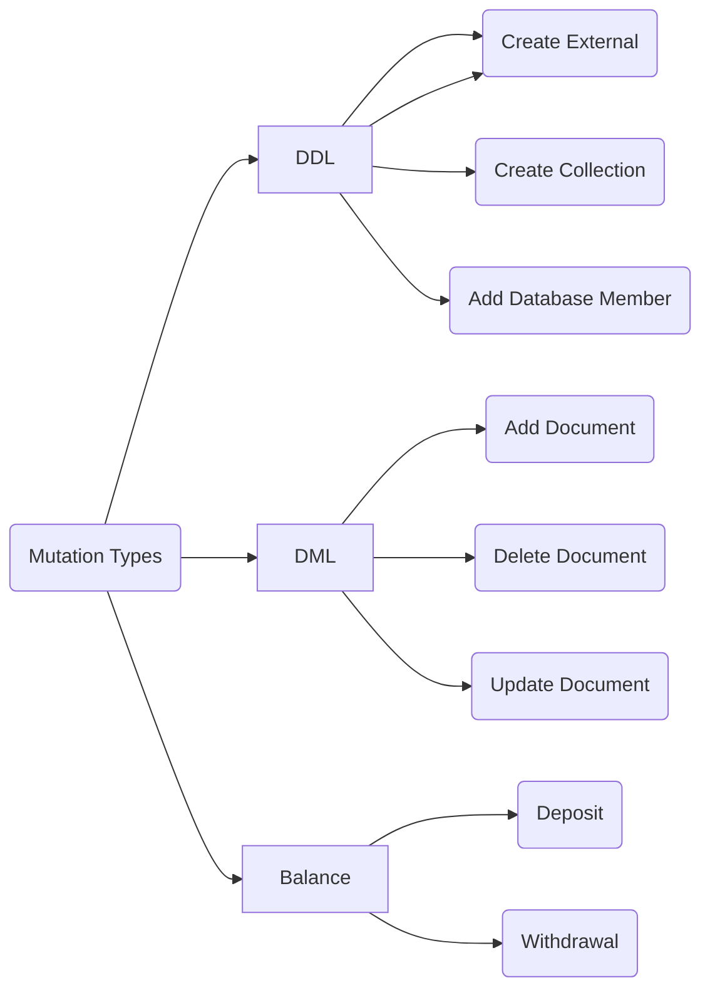

# DIP-000: Structured Binary Data Format for DB3

DB3 Network is building the next generation of the decentralized and permissionless data network for the next big things Web3 and the open data format will cross the entire data network and we must define it at first

## Requirements

The data format should support the following features

* `Delegation Payment` will give the end users a zero gas experience
* `Compression friendly` will reduce the storage cost on L1 storage chain, eg Arweave
* `Privacy Reserved` will enable privacy protection for the end users

## Concepts

* `user` who signs the data and sends the data to db3 network
* `delegation` who will pay the gas fee for users
* `identity`, every user , delegation and database have their unique identity
* `database` which is a group of collections and every database has a unique identity in the db3 network
* `mutation` which is the input of db3 network
* `permission` which is the nft-based permission control
* `external` which is the external smart contract datasource

### Identity

the identity includes three parts

1. type, there are four types `db3_user` ,`db3_db` , `db3_permission` and `db3_external`
2. chain id, this is a unique id of every blockchain and we will use their token as the chain id
3. address, the address in every blockchain

| identity   |      example      |
|----------|-------------|
| user |  db3_user:eth:0xF78c7469939f1f21338E4E58b901EC7D9Aa29679 |
| database |  db3_db:ar:0xF78c7469939f1f21338E4E58b901EC7D9Aa29679 |
| permission |  db3_permission:eth:0xF78c7469939f1f21338E4E58b901EC7D9Aa29679 |
| external |  db3_external:eth:0xF78c7469939f1f21338E4E58b901EC7D9Aa29679 |

## Data Flow

We can see 

* 1st the input mutation will be packed into block stored in the layer2
* 2nd the block will be packed in block group stored in the Arweave

## Mutation

### Data Type

the data type will follow the [LogicalTypes of parquet](https://github.com/apache/parquet-format/blob/master/LogicalTypes.md)

### Schema

| name   |     type      | description|required|
|----------|-------------|------------|--------|
| version |STRING| the version of format|Yes|
| chain_id |STRING| the id of db3 network|Yes|
| sender_payment_chain_id|STRING| the id of payment chain|Yes|
| nonce |int64| the nonce of sender|Yes|
| sender_signature |BINARY| the signature of data|Yes|
| sender_public_key |BINARY| the public key of sender|Yes|
| type | ENUM|the type of mutation|Yes|
| data|BINARY| the data related to the mutation type|Yes|

#### Mutation Types

The mutation types are the input data types of db3 network

##### The type of Create External

| name   |     type      | description|required|
|----------|-------------|------------|--------|
| description | STRING| a simple description for the external|No|
| chain_id | STRING| the chain id of smart contract |Yes|
| contract_addr | STRING| the addr of smart contract |Yes|
| contract_abi  | STRING| the abi of smart contract |Yes|

##### The type of Create Database

| name   |     type      | description|required|
|----------|-------------|------------|--------|
| description | STRING| a simple description for the database|No|
| permission_list | STRING[]| the permission list, no permission control if the permission_lis is empty |No|

##### The type of Create Collection

| name   |     type      | description|required|
|----------|-------------|------------|--------|
| database | STRING| the database address|Yes|
| name | STRING| the name of collection|Yes|
| index_list | INDEX | the extra indexs for the collection|Optional|

the schema of index

| name   |     type      | description|required|
|----------|-------------|------------|--------|
|name | STRING| the name of index|Yes|
|fields | STRING[]| the column names used in the index|Yes|
|type | ENUM| the type of index, ordered_index, graph_index, vector_index|Yes|

##### The type of Add Document

| name   |     type      | description|required|
|----------|-------------|------------|--------|
|database | STRING| the database address|Yes|
|collection | STRING | the name of collection|Yes|
|documents | BSON[]| The document array in bson format|Yes|

##### The type of Delete Document

| name   |     type      | description|required|
|----------|-------------|------------|--------|
|database | STRING| the database address|Yes|
|collection | STRING | the name of collection|Yes|
|id_list | STRING[]| The id array|Yes|

Delete document is allowed only for the document owner

##### The type of Update Document

| name   |     type      | description|required|
|----------|-------------|------------|--------|
|database | STRING| the database address|Yes|
|collection | STRING | the name of collection|Yes|
|masks | BSON[]| the masks to tag which field will be effected by the updates |Yes|
|documents | BSON[]| the document patches|Yes|

Update document is allowed only for the document owner

### Generate the Sender Signature

the first step generate the hash to be signed, db3 network uses the merkle tree with sha256 hash fuction to generate the root hash of mutation

use the native signature scheme of  sender_payment_chain_id to sign the hashed message

## Bundle

a group of mutation

### Schema

| name   |     type      | description|required|
|----------|-------------|------------|--------|
| version |STRING| the version of format|Yes|
| chain_id |STRING| the id of db3 network|Yes|
| sender_payment_chain_id|STRING| the id of payment chain|Yes|
| nonce |int64| the nonce of sender|Yes|
| sender_signature |BINARY| the signature of data|Yes|
| sender_public_key |BINARY| the public key of sender|Yes|
| mutation_list|Mutation[]| a group of mutations|Yes|

# Reference

* [The striping and assembly algorithms from the Dremel paper](https://github.com/julienledem/redelm/wiki/The-striping-and-assembly-algorithms-from-the-Dremel-paper)
* [ANS-104: Bundled Data v2.0 - Binary Serialization](https://github.com/joshbenaron/arweave-standards/blob/ans104/ans/ANS-104.md)
