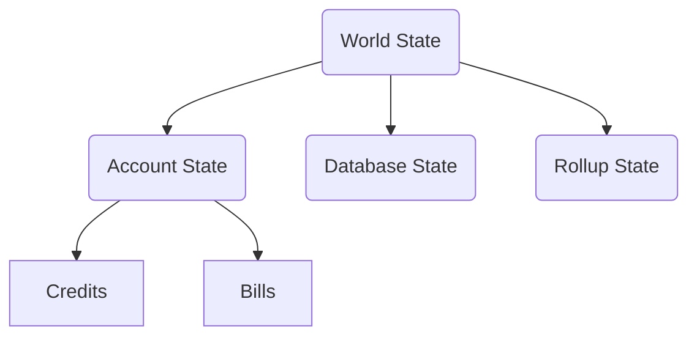
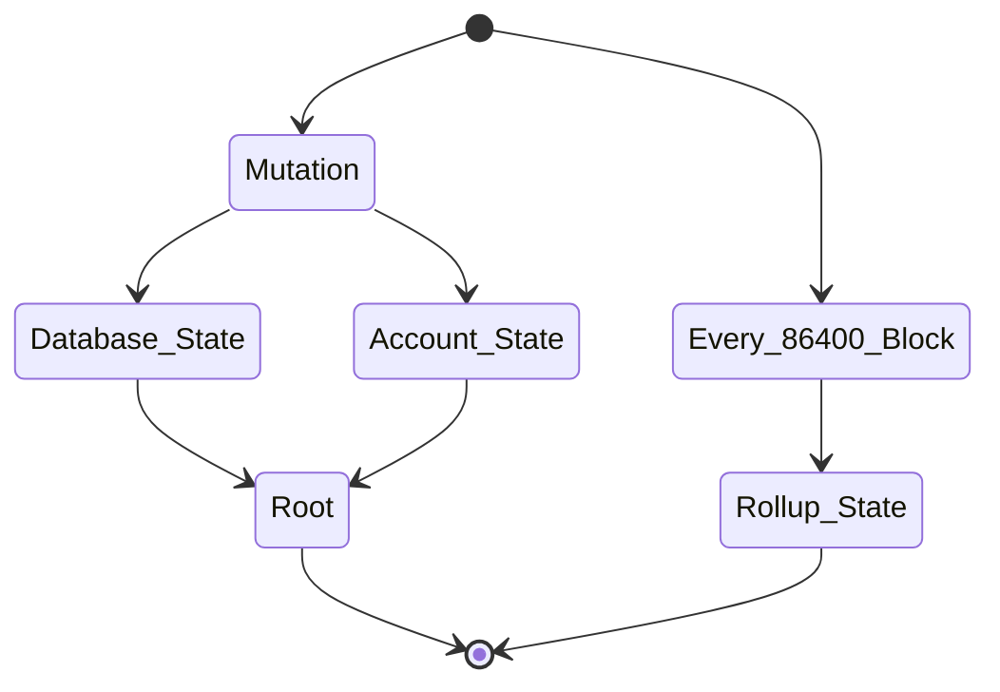

# DIP-001: The world state of layer 2

## Concepts

* `Account State` which include the credits and bills
* `Database State` which include the data state of database
* `Rollup State` which include the job state of rollup and the mapping between block and file on L1 storage network

## State machine

