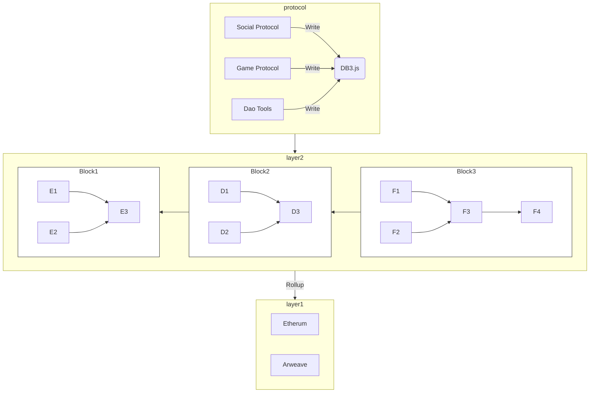

# DB3 Network:A Decentralized and Scalable AR-Rollup Data Network

## Overview

```mermaid
graph TD
    subgraph protocol
        A[Social Protocol] -->|Write| SDK(DB3.js)
        B[Game Protocol] -->|Write| SDK(DB3.js)
        C[Dao Tools] -->|Write| SDK(DB3.js)
    end
    subgraph layer2
        subgraph Block1
            direction LR
            E1 --> E3
            E2 --> E3
            style Block1 fill:#fff,stroke:#333,stroke-width:1px
        end
        subgraph Block2
            direction LR
            D1 --> D3
            D2 --> D3
            style Block2 fill:#fff,stroke:#333,stroke-width:1px
        end
        subgraph Block3
            direction LR
            F1 --> F3
            F2 --> F3
            F3 --> F4
            style Block3 fill:#fff,stroke:#333,stroke-width:1px
        end
        Block2 --> Block1
        Block3 --> Block2
        direction RL
    end
    subgraph layer1
        Etherum
        Arweave
    end
    protocol --> layer2
    layer2 --> |Rollup|layer1

```